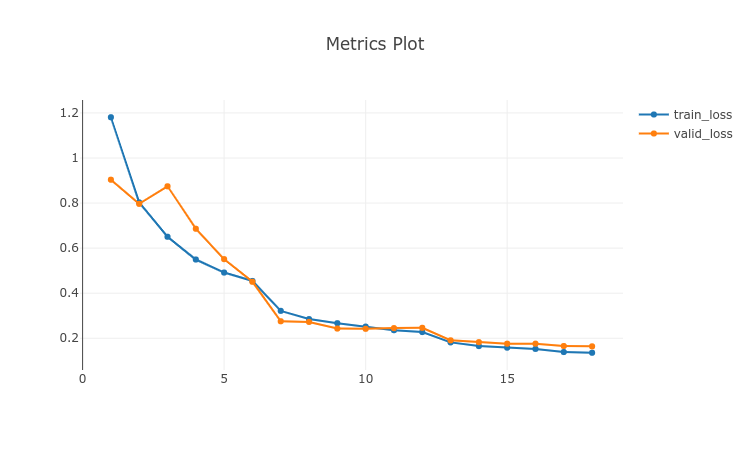
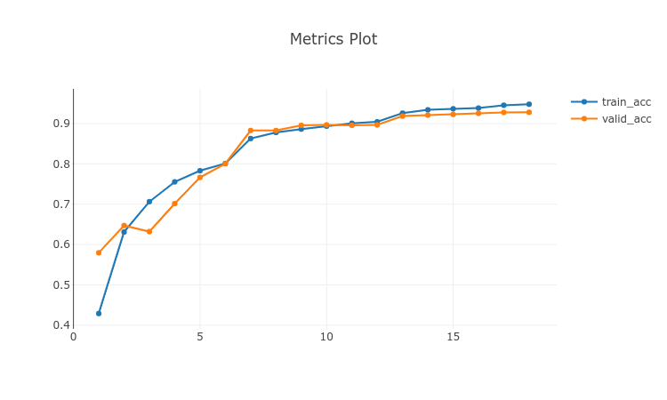

reference : https://github.com/davda54/sam

using sacred & omniboard

- using omniboard
  `omniboard -m localhost:27017:ImageClassification`
- train
  `python trainer.py`
- inference
  `python inference.py`

## Loss

## top1 accuracy

